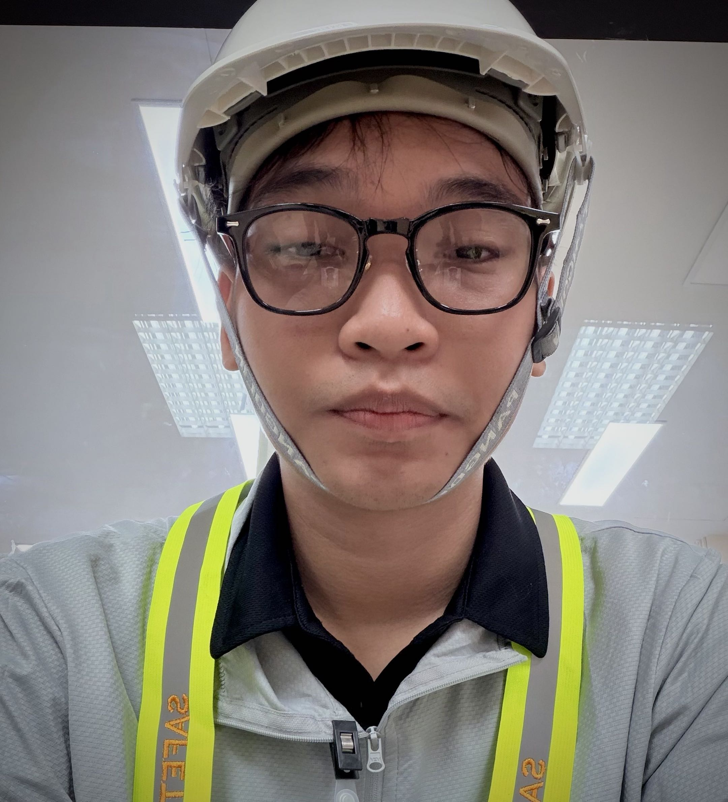
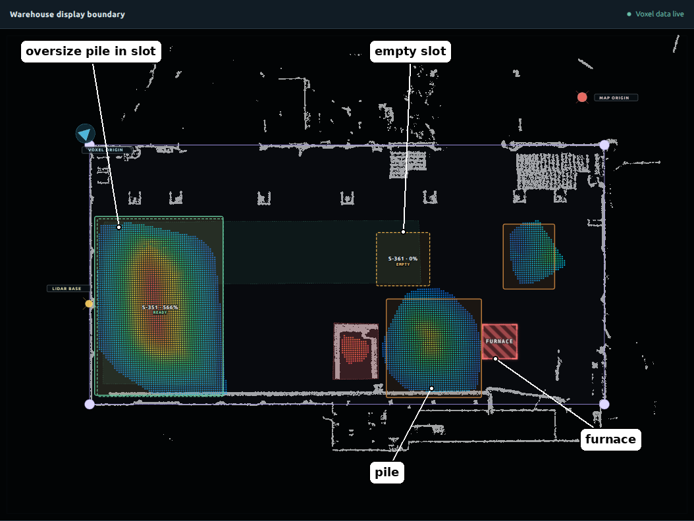
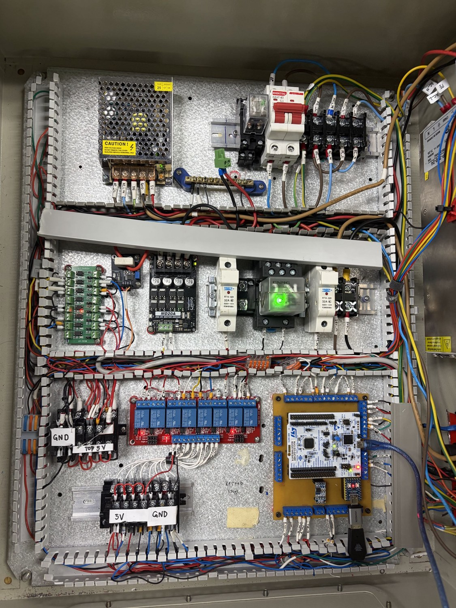
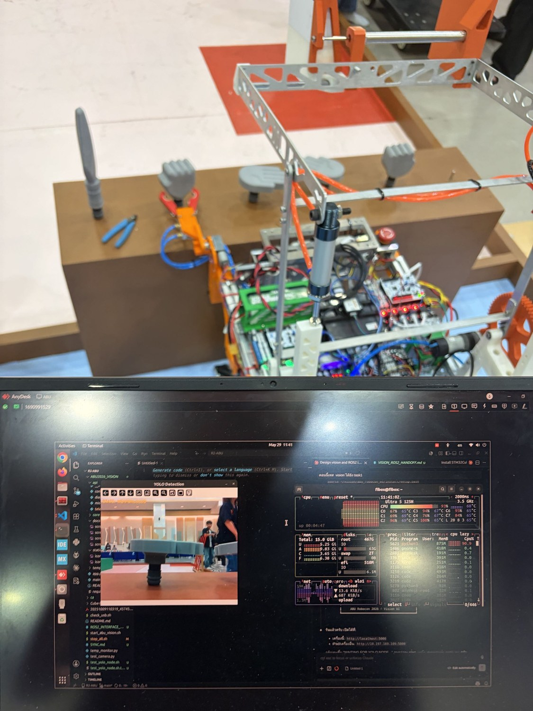

<h1 align="center">Bhirabhat Klomjit (Pae / PaYae)</h1>
<h3 align="center">Robotics & Automation Engineering Student</h3>

Robotics Integration · Industrial Systems · Embedded Control

FIBO, KMUTT · 3rd Year

  
  
  

---

### About

Robotics & Automation Engineering student at **FIBO, KMUTT** with hands-on experience across robotics integration, industrial systems, embedded/electrical hardware, deployment, testing, and troubleshooting.

I work across subsystem boundaries, connecting software, ROS 2, data systems, embedded/control hardware, and real robotic systems.

---

### Featured Engineering Work

**FIBO — Pile Monitoring & Industrial Station Integration** 
Database/state design and station-side integration for an industrial LiDAR-based pile-monitoring system, including read-only robot-status integration, operator validation tools, deployment, monitoring, and field troubleshooting.

**Warehouse AMR — Robot Interface Web App & ROS 2 Integration** 
Developed the robot-interface web application and ROS 2 action bridge for manual control, mission workflows, robot state, software safety, and real-robot testing.

**1-DOF Pick-and-Place Arm** 
Designed and built the complete electrical/control system around an STM32G474RE, including EasyEDA schematics, control-box wiring, sensors, safety circuitry, firmware, and hardware debugging.

**ABU Robocon — Meihua** 
Handled mobile-base software integration using ROS 2 and micro-ROS, connecting high- and low-level interfaces and testing/tuning the real robot.

  
  
  
  

---

### Core Technologies

 `micro-ROS`    `MQTT` 
  `EasyEDA` `SolidWorks` 
  

---

### Full Portfolio

**[View Full Engineering Portfolio →](https://github.com/Peaxtt/Portfolio)**

Detailed project roles, hardware work, schematics, field testing, and technical experience.

---

### Contact

  <b>Email</b> &nbsp; <a href="mailto:bhirabhat.klom@mail.kmutt.ac.th">bhirabhat.klom@mail.kmutt.ac.th</a> 
  <b>LINE ID</b> &nbsp; bhirabhat

